# Level-up CSP Technical Training – Power Platform Facilitator Guide 

# Create a Holidays List Plugin

| Description      | A hands-on experience to inspire users to use Copilot Studio to develop a Holiday List Plugin.                                                                                                                                            |
|------------------|-------------------------------------------------------------------------------------------------------------------------------------------------------------------------------------------------------------------------------------------|
| Prerequisites    | To get the most out of this training we recommend you have admin access on Copilot Studio.                                                                                                                                                |
| Audience         | Microsoft partners will deliver this workshop to CSP customers, who have multiple employees in their company, have a Microsoft Power Apps for Developer and Microsoft Power Automate license, and have minimal Copilot Studio experience. |
| Duration         | 20 minutes                                                                                                                                                                                                                                |
| Publication date | September 2024                                                                                                                                                                                                                            |

This document is provided “as-is”. Information and views expressed in
this document, including URL and other Internet Web site references, may
change without notice. You bear the risk of using it.

This document does not provide you with any legal rights to any
intellectual property in any Microsoft product. You may copy and use
this document for your internal reference purposes.

© 2024 Microsoft. All rights reserved.

# Objective and Scenario

## **Objective**

Develop a conversational action that can be published as a Plugin to
enable interaction within a cross-organizational group.

## **Solution focus area**

Contoso Corp, a leading IT solutions provider, is at the forefront of
innovation, harnessing the power of generative AI to drive business
efficiencies and enhance customer experiences. In 2023, Contoso has
successfully developed a suite of out-of-the-box experiences that allow
users to engage seamlessly with a wealth of content and resources across
an organization, all powered by Microsoft Copilot Studio.

Now, Contoso wants to create a solution that facilitates interaction
among cross-organizational groups. Contoso wants to demonstrate this
solution to its customers to showcase the transformative potential of
generative AI in real-world applications.

Based on the above requirements, you have decided to develop a solution
that involves creating a conversational action using Microsoft Copilot
Studio, which will be published as a Copilot Plugin. This initiative
aims to enhance the value that customers derive from Copilot for M365,
providing them with a more interactive and efficient experience.

The Plugins will be available in the Microsoft Copilot in production, if
the organization has valid license for the same.

## **Personas** 

- **Mark Brown** – Project lead

- **David Flores** – Copilot developer

- **Jane Miller** – Copilot tester

These personas will participate in the following sequential scenarios:

- Mark Brown, the Project Lead at Contoso Corp, provides David Flores
  with an overview of the tools and processes involved in creating a
  conversational action using Microsoft Copilot Studio and publishing
  it. Mark tasks David with creating a conversational action focused on
  holidays for the year 2024.

- David successfully creates a conversational action and publishes it.

- Once the conversational action is complete, David asks Mark for
  approval of the Plugin, which would allow it to be integrated into the
  organization's M365 Chat experiences. Mark promptly reviews the Plugin
  and, upon approval, enlists Jane Miller to conduct thorough testing.

- Jane interacts with the Plugin, provides valuable feedback and
  confirms its functionality. After successfully validating the Plugin,
  Mark Brown officially hands over the solution to the team. This
  milestone enables them to demonstrate the new conversational action to
  customers, enhancing their engagement and service offerings.

> **Note:** The steps, after the action is published can be performed
> only if the organization holds a valid Copilot license with Admin
> rights for Mark to approve it from the admin center followed by the
> testing by Jane.

# Exercise 1: Create a Conversational action

**Objective**:

In this exercise, we will sign in for the Copilot Studio trial license,
and then create a conversational action which will help to retrieve the
list of holidays for the year 2024.

1.  Login to **https://copilotstudio.microsoft.com/** using your tenant
    credentials

2.  In the **Welcome to Copilot Studio** popup, leave the
    **country/region** as the default value and select **Start free
    trial**.

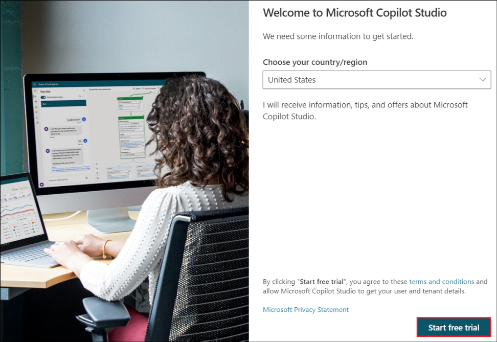

3.  Select **Environments** on the top right and select **Dev One** from
    it.

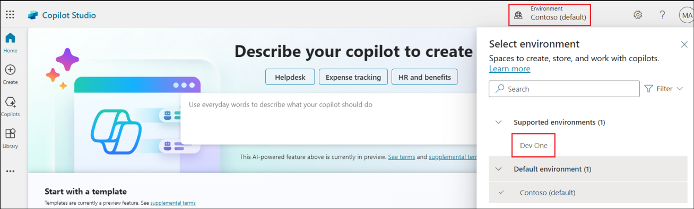

4.  Select **Copilots** from the left pane.

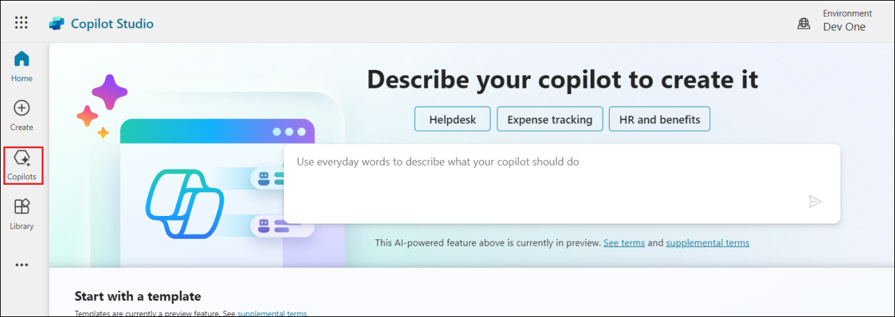

5.  Select **Copilot for Microsoft 365**.

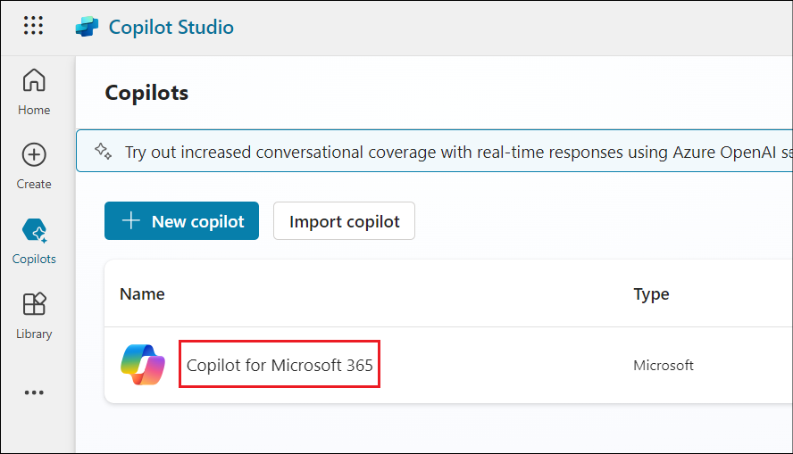

6.  Select **Actions** from the top menu.

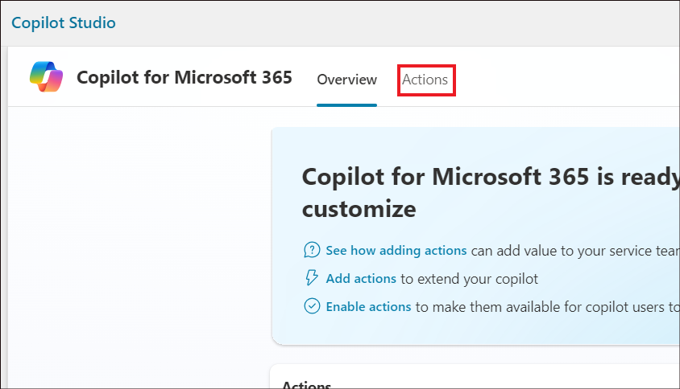

7.  Select **+ Add an action**.

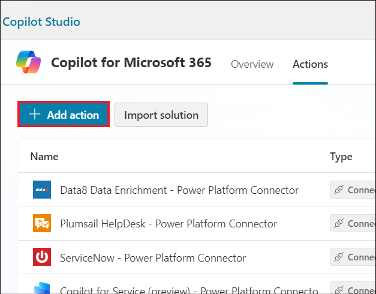

8.  Select **Conversational** in the **New action** pane.

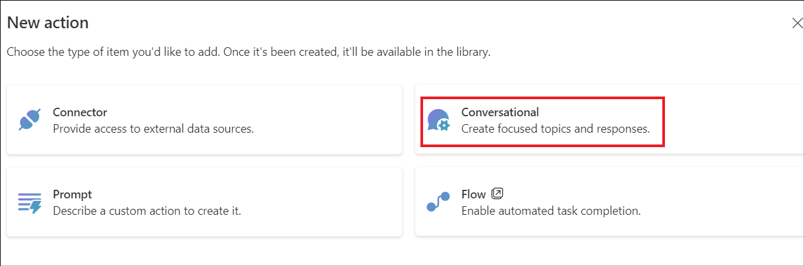

9.  Type in the name for the action as **Holiday List**. Select
    **Create**.

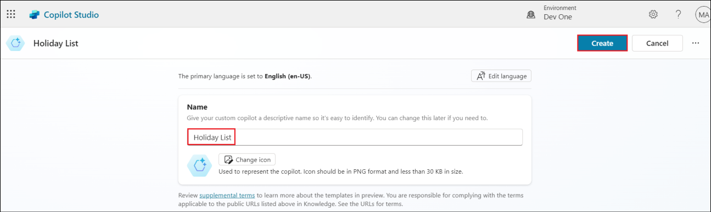

10. Once ready, the created action opens in Authoring canvas. Select
    **Topics**.

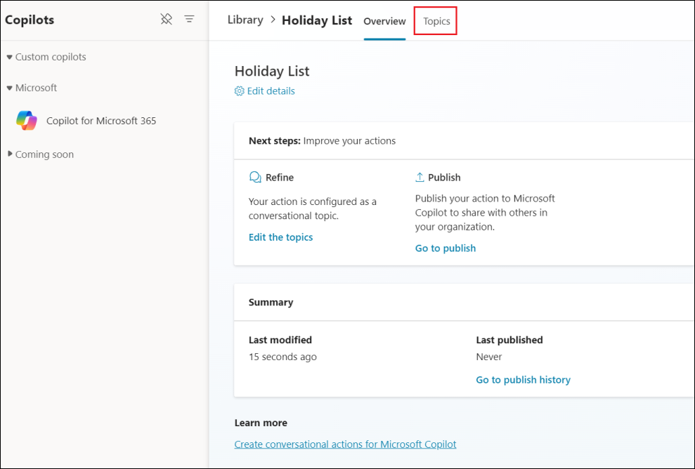

11. Name the topic as **Holidaylisttopic**.

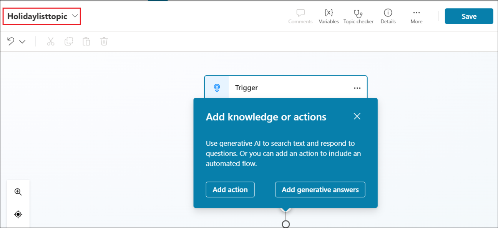

12. In the Trigger node’s description, provide a clear description of
    how the conversational plugin can help the user and what it can
    do. Let this topic help the user to find the list of holidays in the
    year 2024.

Type **This plugin helps to retrieve the list of holidays for the year
2024.** in the Trigger node’s description.

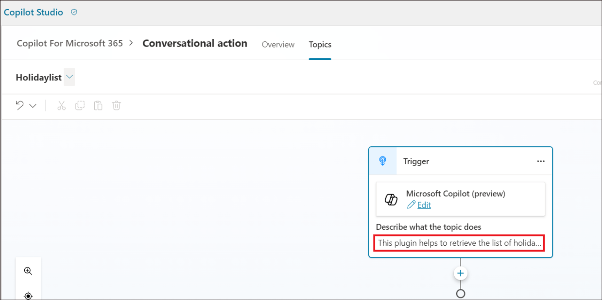

This description has functional purpose and is used by the Microsoft
Copilot to determine whether to invoke your plugin or not.

13. Add a message node below the Trigger node.

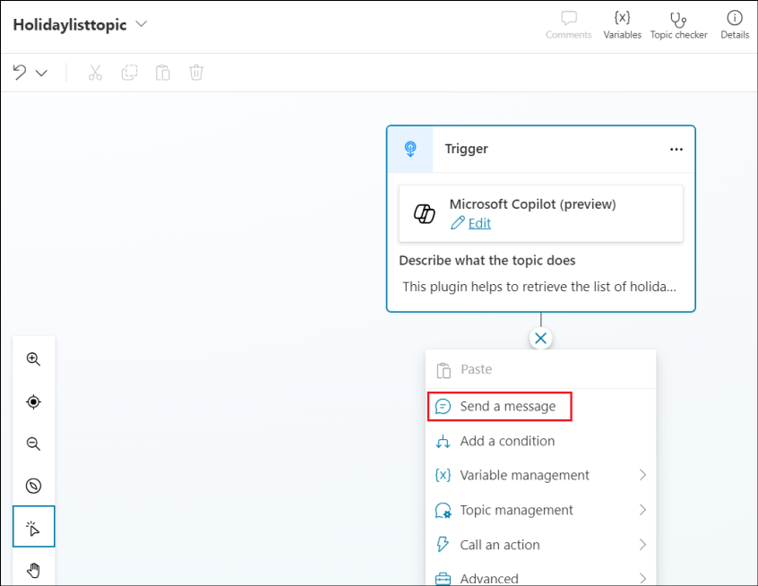

14. Paste the below details to populate the message node with the **list
    of holidays**.

    - New Year's Day - January 1

    - Martin Luther King, Jr.'s Birthday (Third Monday of January) -
      January 15, 2024

    - Washington's Birthday or Presidents' Day (third Monday of
      February) - February 19

    - Memorial Day (last Monday of May) - May 27

    - Juneteenth Day - June 19

    - Independence Day - July 4

    - Labor Day (first Monday of September) - September 2

    - Columbus Day (Second Monday of October) - October 14

    - Veterans Day or Veterans Day - November 11

    - Thanksgiving Day (fourth Thursday of November): November 28

    - Christmas Day - December 25

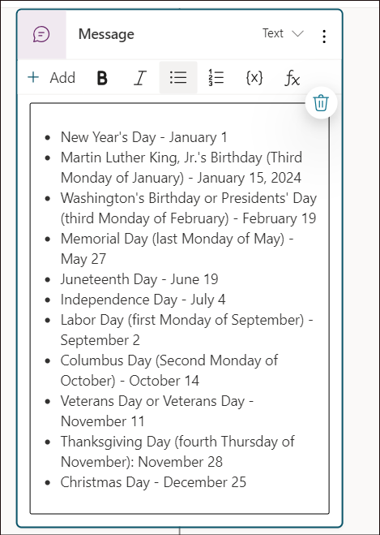

15. Click on **Save** to save the action.

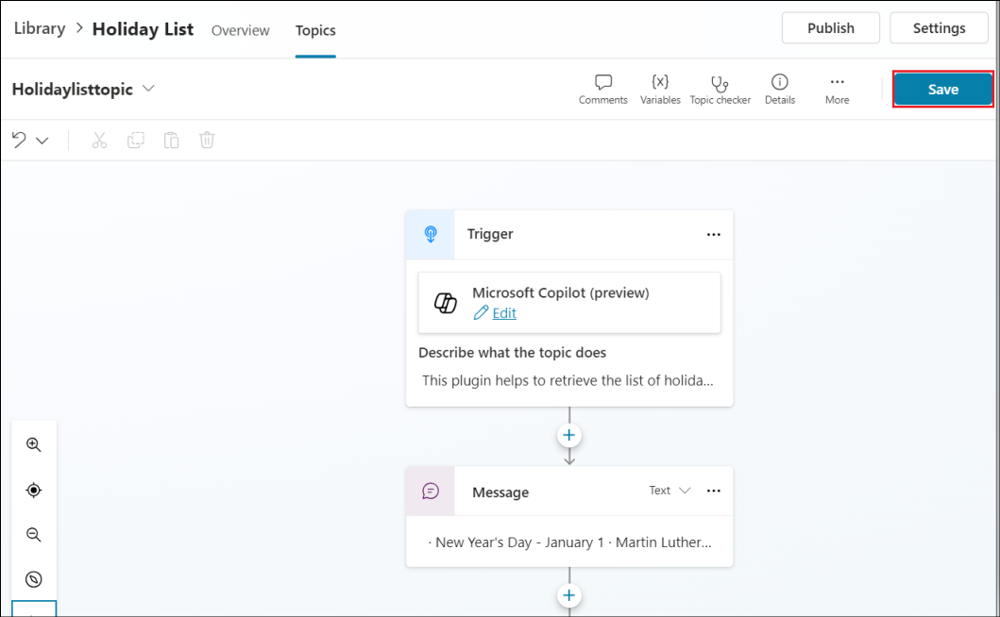

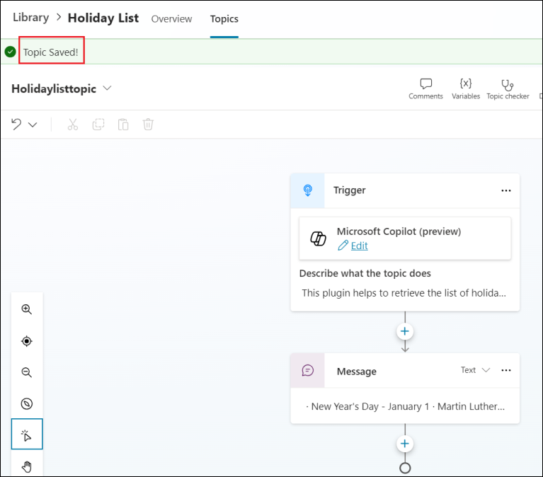

**Summary**:

In this exercise, we have designed a conversational action and explained
in the topic description about when this specific action needs to be
invoked. Based on this, the action will be invoked when someone needs
information regarding the list of holidays for the year 2024.

# Exercise 2: Publishing your conversational action to Microsoft Copilot

**Objective:**

The objective of this exercise is to publish the action that we created
in the previous exercise.

1.  Publishing your conversational plugin creates a new plugin in the
    Dataverse registry for your Tenant. Once available there, your
    tenant admin needs to approve your plugin to be available to users
    in the Microsoft Copilot plugins catalog.

2.  Click on **Publish**.

> 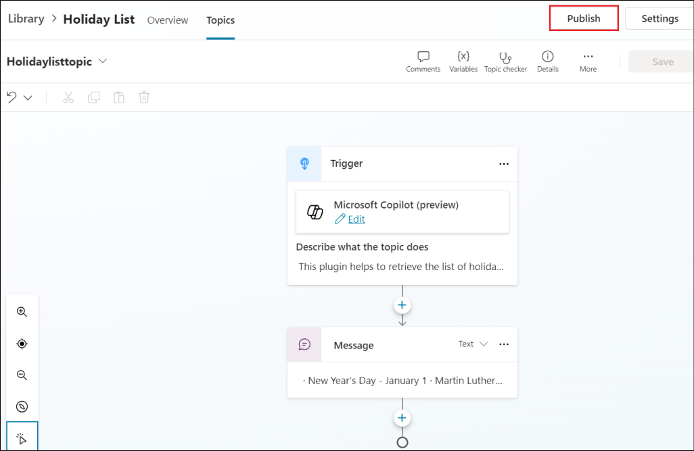 alt="A screenshot of a computer Description automatically generated" />

3.  Select **Publish.**

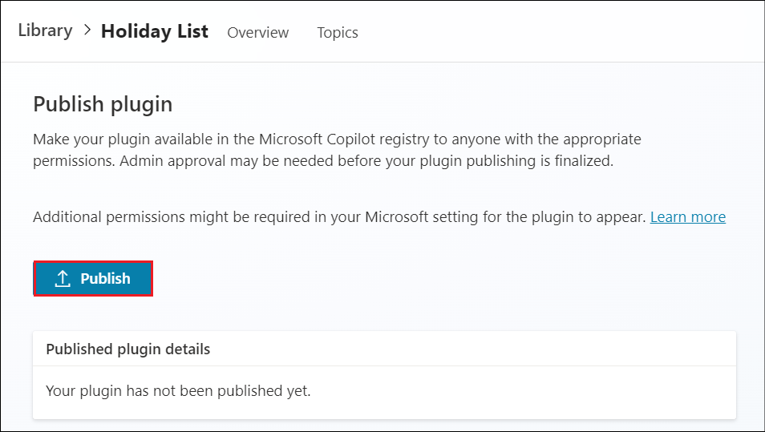

4.  Select **Publish** on **Publish latest content** dialog.

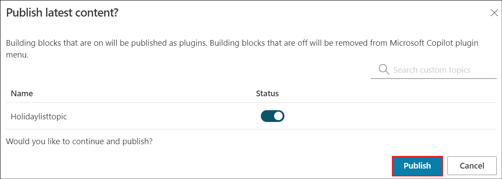

5.  The publish status is shown on the screen.

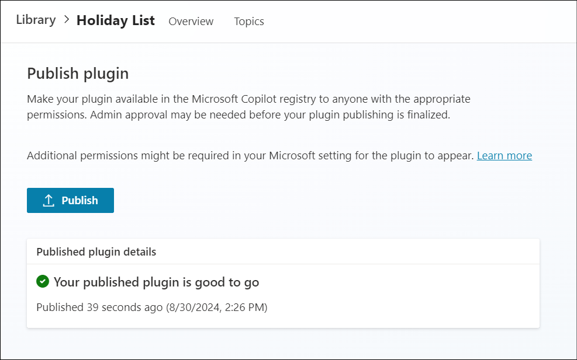

**Note:** The publishing should complete quickly. The actual
availability in the Microsoft Admin Center can take up to 4 hours.

**Important :** For the admin to get it listed in the admin center, the
company will have to hold a valid Copilot license.

6.  Your Admin can find the **Dataverse and Microsoft Copilot
    Studio** integrated app in the Microsoft Admin Center
    under **Settings**, then **Integrations to be reviewed and
    approved**.

7.  Once your Tenant admin approves the Dataverse and Microsoft Copilot
    Studio integrated app, it should appear in the user's list of
    plugins in their Microsoft Copilot UI.

**Exercise Summary:**

In this exercise, we have learnt to publish the action. And, how it can
be approved by the admin after which it will appear as a plugin in the
Microsoft Copilot.

**Summary:**

In this lab, we have learnt how to create a conversational action and to
publish it.
